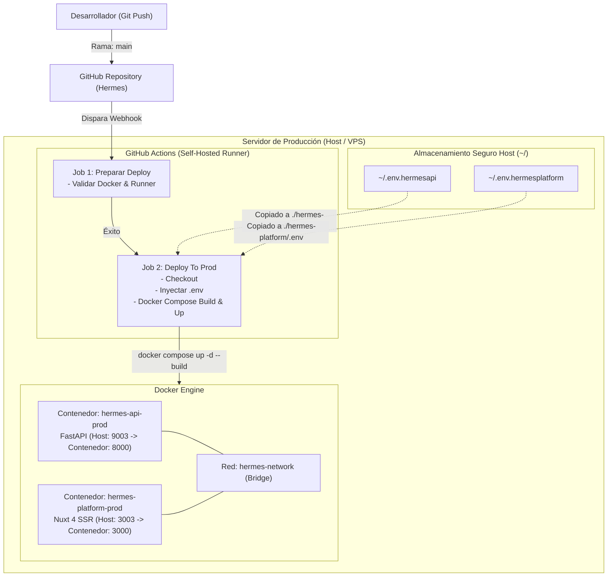

# Especificación de CI/CD y Despliegue (Deploy)

Este documento detalla la arquitectura, configuración y especificación técnica del flujo de **Integración y Despliegue Continuo (CI/CD)** para la plataforma **Hermes** en un servidor de producción (*Self-Hosted Runner*) utilizando **Docker**, **Docker Compose** y **GitHub Actions**.

---

## 1. Objetivos del Flujo de Despliegue

* **Automatización Total**: Desplegar de forma desatendida y segura la plataforma completa al fusionar o empujar cambios a la rama principal (`main`).
* **Entorno de Ejecución Propio**: Uso exclusivo de **GitHub Actions Self-Hosted Runner** instalado directamente en el servidor de producción.
* **Aislamiento en Contenedores**: Empaquetado estandarizado mediante `Dockerfile` independientes para `hermes-api` y `hermes-platform`, coordinados por `docker-compose`.
* **Seguridad de Credenciales**: Inyección de variables de entorno de producción desde el directorio raíz del servidor (`~/.env.hermesapi` y `~/.env.hermesplatform`), manteniéndolas fuera del repositorio Git.
* **Optimizado para Servidores Pequeños**: Configuración ligera de recursos, construcción multi-etapa y limpieza automática de contenedores huérfanos e imágenes obsoletas.

---

## 2. Topología y Arquitectura del Despliegue



---

## 3. Estructura de Variables de Entorno en el Servidor

En el directorio del usuario del servidor host (`$HOME` / `~`), residirán los archivos de variables de entorno protegidos:

### 3.1. Backend: `~/.env.hermesapi`
Se copiará a `./hermes-api/.env` durante el despliegue:
```ini
HOST=0.0.0.0
PORT=8000
ENVIRONMENT=production
CORS_ORIGINS=http://localhost:3000,https://tu-dominio.com

# MongoDB
MONGO_HOST=mongodb://localhost:27017/ # o URI de MongoDB Atlas
MONGO_DATABASE=hermes_db

# Firebase & Criptografía
FIREBASE_CREDENTIALS_PATH=config/serviceAccountKey.json
ENCRYPTION_KEY=tu_fernet_key_generada_en_base64

# JWT Session
JWT_SECRET_KEY=tu_jwt_secret_ultra_seguro_produccion
JWT_ALGORITHM=HS256
JWT_ACCESS_TOKEN_EXPIRE_MINUTES=1440
```

### 3.2. Frontend: `~/.env.hermesplatform`
Se copiará a `./hermes-platform/.env` durante el despliegue:
```ini
NUXT_PUBLIC_API_BASE_URL=https://api.tu-dominio.com # o http://tu-ip:8000
NUXT_PUBLIC_FIREBASE_API_KEY=tu_firebase_api_key
NUXT_PUBLIC_FIREBASE_AUTH_DOMAIN=tu-proyecto.firebaseapp.com
NUXT_PUBLIC_FIREBASE_PROJECT_ID=tu-proyecto
NUXT_PUBLIC_FIREBASE_STORAGE_BUCKET=tu-proyecto.firebasestorage.app
NUXT_PUBLIC_FIREBASE_MESSAGING_SENDER_ID=123456789
NUXT_PUBLIC_FIREBASE_APP_ID=1:123456789:web:abcdef
```

---

## 4. Especificación del Workflow de GitHub Actions (`.github/workflows/deploy.yml`)

El pipeline constará de **2 jobs secuenciales** y se ejecutará únicamente en la rama `main`:

```yaml
name: CI/CD Pipeline - Hermes Production

on:
  push:
    branches:
      - main

jobs:
  # ── JOB 1: Preparación y Validación del Entorno ──
  preparar-deploy:
    name: 🔍 Preparando deploy
    runs-on: self-hosted
    steps:
      - name: ⚡ Validar conexión y entorno del Runner
        run: |
          echo "=========================================="
          echo "  Verificando estado del runner y entorno"
          echo "=========================================="
          echo "Directorio de trabajo actual: $PWD"
          echo "Usuario ejecutando: $(whoami)"
          docker --version
          docker compose version
          echo "¡El runner está listo y conectado correctamente!"

  # ── JOB 2: Despliegue en Producción ──
  deploy-prod:
    name: 🚀 Deploy To Prod
    needs: preparar-deploy
    runs-on: self-hosted
    if: github.ref == 'refs/heads/main'
    steps:
      - name: 📥 Checkout del código
        uses: actions/checkout@v4

      - name: ⚙️ Preparar variables de entorno (producción)
        run: |
          echo "Copiando variables de entorno desde el host..."
          cp ~/.env.hermesplatform ./hermes-platform/.env
          cp ~/.env.hermesapi ./hermes-api/.env
          echo "Variables de entorno inyectadas exitosamente."

      - name: 🚀 Desplegar Backend (FastAPI - Puerto 9003)
        run: |
          echo "Desplegando servicio Backend (hermes-api-prod) en puerto 9003..."
          docker rm -f hermes-api-prod || true
          docker compose -p hermes-prod up -d --build --remove-orphans hermes-api

      - name: 🚀 Desplegar Frontend (Nuxt 4 - Puerto 3003)
        run: |
          echo "Desplegando servicio Frontend (hermes-platform-prod) en puerto 3003..."
          docker rm -f hermes-platform-prod || true
          docker compose -p hermes-prod up -d --build --remove-orphans hermes-platform

      - name: 🧹 Limpieza de imágenes huérfanas
        run: |
          echo "Limpiando imágenes Docker no utilizadas para liberar espacio..."
          docker image prune -f
          echo "¡Despliegue completado con éxito!"
```

---

## 5. Especificación de Dockerización

### 5.1. Backend Dockerfile (`hermes-api/Dockerfile`)
* **Imagen Base**: `python:3.11-slim`
* **Directorio de Trabajo**: `/app`
* **Instalación de Dependencias**: Vía `assets/requirements.txt` sin caché (`--no-cache-dir`).
* **Exposición**: Puerto `8000`.
* **Comando de Inicio**: `uvicorn src.app.main:app --host 0.0.0.0 --port 8000 --workers 2`.

```dockerfile
FROM python:3.11-slim

WORKDIR /app

# Instalar dependencias del sistema necesarias
RUN apt-get update && apt-get install -y --no-install-recommends \
    curl \
    && rm -rf /var/lib/apt/lists/*

# Copiar requerimientos e instalar dependencias de Python
COPY assets/requirements.txt ./requirements.txt
RUN pip install --no-cache-dir -r requirements.txt

# Copiar código fuente
COPY . .

EXPOSE 8000

CMD ["uvicorn", "src.app.main:app", "--host", "0.0.0.0", "--port", "8000", "--workers", "2"]
```

---

### 5.2. Frontend Dockerfile (`hermes-platform/Dockerfile`)
* **Construcción Multi-Stage** para optimizar el tamaño final de la imagen en servidores pequeños.
* **Stage 1 (Builder)**: `node:22-alpine` (requerido para compatibilidad con métodos ES2024 de PostCSS / Nuxt 4).
  - Instala dependencias (`npm ci`).
  - Ejecuta `npm run build` (produce `.output/`).
* **Stage 2 (Runner)**: `node:22-alpine`
  - Copia únicamente el artefacto optimizado `.output/`.
  - Configura variables de entorno `HOST=0.0.0.0` y `PORT=3000`.
  - Ejecuta `node .output/server/index.mjs`.

```dockerfile
# Stage 1: Build Nuxt 4 SSR
FROM node:22-alpine AS builder

WORKDIR /app

COPY package*.json ./
RUN npm ci

COPY . .
RUN npm run build

# Stage 2: Minimal Production Runner
FROM node:22-alpine AS runner

WORKDIR /app

ENV NODE_ENV=production
ENV HOST=0.0.0.0
ENV PORT=3000

COPY --from=builder /app/.output ./.output

EXPOSE 3000

CMD ["node", ".output/server/index.mjs"]
```

---

### 5.3. Orquestación con Docker Compose (`docker-compose.yml`)
* **Nombre de Proyecto**: `hermes-prod`
* **Servicios**:
  - `hermes-api`:
    - Construcción desde `./hermes-api`.
    - Mapeo de puertos: `9003:8000` (Host: 9003 -> Contenedor: 8000).
    - Variable de entorno `env_file: ./hermes-api/.env`.
    - Reinicio: `restart: unless-stopped`.
    - Límite de memoria para VPS pequeño: `512MB`.
  - `hermes-platform`:
    - Construcción desde `./hermes-platform`.
    - Mapeo de puertos: `3003:3000` (Host: 3003 -> Contenedor: 3000).
    - Variable de entorno `env_file: ./hermes-platform/.env`.
    - Dependencia: `depends_on: [hermes-api]`.
    - Reinicio: `restart: unless-stopped`.
    - Límite de memoria para VPS pequeño: `512MB`.
* **Red**: `hermes-network` tipo `bridge`.

```yaml
version: "3.8"

services:
  hermes-api:
    container_name: hermes-api-prod
    build:
      context: ./hermes-api
      dockerfile: Dockerfile
    restart: unless-stopped
    env_file:
      - ./hermes-api/.env
    ports:
      - "9003:8000"
    networks:
      - hermes-network
    deploy:
      resources:
        limits:
          memory: 512M

  hermes-platform:
    container_name: hermes-platform-prod
    build:
      context: ./hermes-platform
      dockerfile: Dockerfile
    restart: unless-stopped
    env_file:
      - ./hermes-platform/.env
    ports:
      - "3003:3000"
    depends_on:
      - hermes-api
    networks:
      - hermes-network
    deploy:
      resources:
        limits:
          memory: 512M

networks:
  hermes-network:
    driver: bridge
```

---

## 6. Checklist de Puesta en Marcha del Servidor

Para que el pipeline funcione al primer push a `main`:

1. **Instalación de Dependencias en el Servidor**:
   - Docker Engine y Docker Compose plugin (`docker compose`).
   - Git.
2. **Configuración del GitHub Actions Runner**:
   - Configurado como servicio de sistema (`./svc.sh install && ./svc.sh start`).
   - El usuario del runner debe pertenecer al grupo `docker` (`sudo usermod -aG docker $USER`).
3. **Creación de Archivos de Variables de Entorno**:
   - Crear `~/.env.hermesapi` con las llaves de base de datos, Fernet y Firebase.
   - Crear `~/.env.hermesplatform` con los endpoints y keys de Firebase.
4. **Archivo de Credenciales de Firebase Admin SDK**:
   - Asegurar que `serviceAccountKey.json` esté ubicado en la ruta configurada en `~/.env.hermesapi` (o montado como volumen si aplica).
