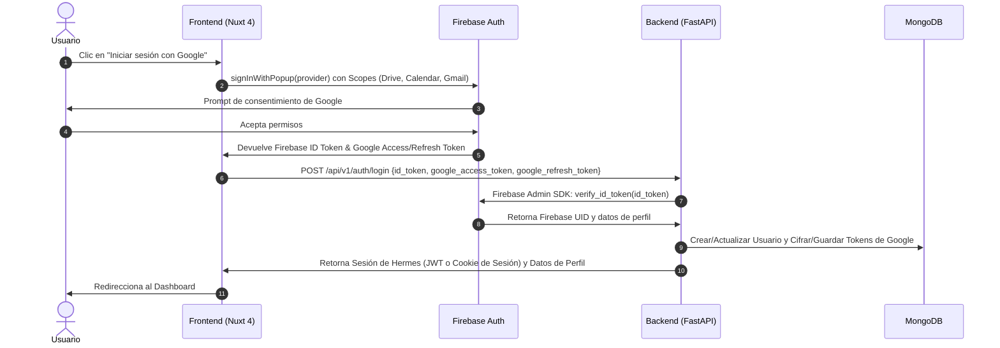

# Especificación de Requerimientos: Módulo de Autenticación (Auth)

Este documento especifica los requerimientos y el diseño arquitectónico para el primer feature de la plataforma Hermes: **Pantalla de Login y Autenticación con Google (vía Firebase) con acceso a Google Drive, Calendar y Gmail**.

---

## 1. Objetivos del Feature

* Permitir a los usuarios iniciar sesión en la plataforma utilizando su cuenta de Google.
* Solicitar y obtener autorización (scopes de OAuth 2.0) para interactuar con las APIs de Google Drive, Google Calendar y Gmail.
* Validar de forma segura la identidad del usuario en el backend.
* Guardar las credenciales de acceso de Google (tokens) de manera segura para su uso en llamadas en segundo plano a las APIs de Google.
* Proveer una interfaz de usuario premium, con una paleta de colores oscuros, acentos neón y animaciones fluidas basadas en tonos azules y rosas.

---

## 2. Flujo de Autenticación y Ciclo de Vida de Tokens

El flujo de autenticación involucra al cliente (Nuxt 4), Firebase Auth y el servidor backend (FastAPI):



### Scopes de Google OAuth Requeridos
Al configurar el proveedor de Google en Firebase Auth, se deben solicitar explícitamente los siguientes scopes:
* **Google Drive**: `https://www.googleapis.com/auth/drive` (Acceso completo para crear y editar archivos de configuración/datos de la plataforma).
* **Google Calendar**: `https://www.googleapis.com/auth/calendar` (Acceso para leer y escribir eventos del calendario).
* **Gmail**: `https://www.googleapis.com/auth/gmail.modify` (Acceso para enviar, leer y modificar correos electrónicos).

---

## 3. Arquitectura del Frontend (hermes-platform)

La plataforma utiliza **Nuxt 4 (Vue 3)** con la siguiente estructura de directorios orientada a componentes, páginas y plantillas dentro del directorio `app/`:

```
hermes-platform/
└── app/
    ├── assets/
    │   └── css/
    │       └── main.css          # Archivo CSS global con variables y estilos base
    ├── components/               # Componentes atómicos y de UI
    │   ├── atoms/
    │   │   ├── HermesButton.vue  # Botón genérico con efectos neón
    │   │   └── HermesInput.vue   # Input personalizado
    │   └── molecules/
    │       └── GoogleSignInButton.vue # Botón interactivo de inicio de sesión de Google
    ├── layouts/
    │   └── default.vue           # Layout general de la aplicación
    ├── pages/
    │   ├── index.vue             # Redirecciona o muestra login
    │   └── login.vue             # Vista de login (Pantalla inicial)
    ├── templates/                # Estructuras de layouts complejos para las páginas
    │   └── AuthTemplate.vue      # Contenedor visual para pantallas de autenticación
    └── app.vue                   # Punto de entrada de la aplicación
```

### 3.1. Diseño Visual y Estilos (CSS)
Se debe definir el siguiente sistema de diseño en `app/assets/css/main.css` usando variables nativas de CSS:

```css
:root {
  /* Fondos */
  --hermes-bg-base: #18181B;
  --hermes-bg-surface: #27272A;
  
  /* Acentos Neón */
  --hermes-accent-teal: #00FFC6;
  --hermes-accent-blue: #00E5FF;
  --hermes-accent-pink: #FF007F;
  
  /* Texto */
  --hermes-text-primary: #F4F4F5;
  --hermes-text-muted: #A1A1AA;
}

body {
  background-color: var(--hermes-bg-base);
  color: var(--hermes-text-primary);
  font-family: 'Inter', sans-serif;
}
```

### 3.2. Animaciones de Acento (Azul y Rosa)
La pantalla de login debe incluir una experiencia visual interactiva de alta fidelidad:
* **Background Glow**: Un par de orbes difusos flotantes animados con CSS (`@keyframes`) que transicionan lentamente entre los colores principales de acento: Azul (`--hermes-accent-blue`) y Rosa (`--hermes-accent-pink`).
* **Glassmorphism**: La tarjeta de login tendrá un efecto de vidrio esmerilado con bordes degradados brillantes:
  ```css
  .login-card {
    background: rgba(39, 39, 42, 0.6);
    backdrop-filter: blur(12px);
    border: 1px solid rgba(0, 229, 255, 0.2); /* Borde azul sutil */
    box-shadow: 0 8px 32px 0 rgba(255, 0, 127, 0.1); /* Sombra rosa difusa */
    transition: border-color 0.3s ease, box-shadow 0.3s ease;
  }
  .login-card:hover {
    border-color: rgba(255, 0, 127, 0.4);
    box-shadow: 0 8px 32px 0 rgba(0, 229, 255, 0.2);
  }
  ```

---

## 4. Arquitectura del Backend (hermes-api)

La API backend se construirá utilizando **FastAPI** y estará organizada para mantener una separación clara entre la capa de red, la capa de lógica de negocio (servicios) y la capa de datos.

### 4.1. Estructura de Directorios del Backend
```
hermes-api/
└── src/
    ├── app/
    │   ├── endpoints/
    │   │   ├── __init__.py
    │   │   └── auth.py           # Rutas para el manejo de la autenticación
    │   ├── __init__.py
    │   └── main.py               # Punto de entrada de la aplicación FastAPI
    ├── models/
    │   ├── request/
    │   │   ├── __init__.py
    │   │   └── auth.py           # Esquemas de entrada de Pydantic
    │   └── response/
    │       ├── __init__.py
    │       └── auth.py           # Esquemas de salida de Pydantic
    ├── services/
    │   ├── __init__.py
    │   └── firebase_service.py   # Lógica e integración con Firebase Admin SDK
    └── utils/
        └── crypto.py             # Funciones para encriptar tokens de Google en BD
```

### 4.2. Modelos Pydantic (`models/request` y `models/response`)

Los esquemas de entrada y salida de datos estructuran la comunicación API.

#### Modelos de Petición (`models/request/auth.py`)
```python
from pydantic import BaseModel, EmailStr, Field
from typing import Optional

class GoogleLoginRequest(BaseModel):
    id_token: str = Field(..., description="ID Token emitido por Firebase Auth")
    google_access_token: str = Field(..., description="Access Token de Google OAuth")
    google_refresh_token: Optional[str] = Field(None, description="Refresh Token de Google OAuth (opcional)")
    google_token_expiry: int = Field(..., description="Timestamp de expiración del token de Google")
```

#### Modelos de Respuesta (`models/response/auth.py`)
```python
from pydantic import BaseModel, EmailStr
from datetime import datetime

class UserProfileResponse(BaseModel):
    uid: str
    email: EmailStr
    display_name: str
    photo_url: str | None = None
    created_at: datetime

class LoginResponse(BaseModel):
    message: str
    user: UserProfileResponse
    session_token: str
```

### 4.3. Rutas de Autenticación (`app/endpoints/auth.py`)
Las rutas manejarán el ciclo de autenticación:
* `POST /api/v1/auth/login`:
  - Recibe el ID Token de Firebase y los tokens de Google.
  - Llama a `FirebaseService` para verificar el token.
  - Guarda o actualiza al usuario y sus credenciales de Google en MongoDB.
  - Retorna el perfil del usuario y un token de sesión interno para Hermes (o configura una cookie httpOnly).
* `POST /api/v1/auth/logout`:
  - Invalida la sesión actual del usuario.
* `GET /api/v1/auth/me`:
  - Retorna la información de perfil del usuario logueado en la sesión actual.

### 4.4. Servicio de Firebase (`services/firebase_service.py`)
Encapsulará el uso del SDK `firebase-admin`. No debe existir lógica directa de Firebase en los controladores de ruta:
```python
import firebase_admin
from firebase_admin import auth, credentials
from fastapi import HTTPException, status

class FirebaseService:
    def __init__(self):
        # Inicialización del SDK con credenciales de cuenta de servicio
        if not firebase_admin._apps:
            cred = credentials.Certificate("path/to/serviceAccountKey.json")
            firebase_admin.initialize_app(cred)

    def verify_token(self, id_token: str) -> dict:
        try:
            decoded_token = auth.verify_id_token(id_token)
            return decoded_token
        except Exception as e:
            raise HTTPException(
                status_code=status.HTTP_401_UNAUTHORIZED,
                detail=f"Token de Firebase inválido: {str(e)}"
            )
```

---

## 5. Diseño de Base de Datos (MongoDB)

Para almacenar la información del usuario y los tokens necesarios para interactuar con las APIs de Google (Gmail, Calendar, Drive), se proponen dos colecciones en MongoDB:

### 5.1. Colección `users`
Almacena la información de identidad del usuario.
```json
{
  "_id": "firebase_uid_12345",
  "email": "usuario@gmail.com",
  "display_name": "Juan Pérez",
  "photo_url": "https://lh3.googleusercontent.com/a/photo_url",
  "created_at": "2026-08-14T16:24:00Z",
  "updated_at": "2026-08-14T16:24:00Z"
}
```

### 5.2. Colección `user_credentials`
Almacena los tokens de acceso de Google de manera encriptada (usando criptografía simétrica como AES/Fernet en `utils/crypto.py`) para evitar filtración de tokens sensibles.
```json
{
  "_id": "firebase_uid_12345",
  "google_access_token_encrypted": "gAAAAABm...",
  "google_refresh_token_encrypted": "gAAAAABm...",
  "google_token_expiry": "2026-08-14T17:24:00Z",
  "scopes": [
    "https://www.googleapis.com/auth/drive",
    "https://www.googleapis.com/auth/calendar",
    "https://www.googleapis.com/auth/gmail.modify"
  ],
  "updated_at": "2026-08-14T16:24:00Z"
}
```

---

## 6. Configuración en la Plataforma Firebase

Para que este feature funcione, se deben seguir los siguientes pasos administrativos en la Consola de Firebase:
1. Habilitar el proveedor de inicio de sesión **Google** en Authentication.
2. Descargar el archivo `serviceAccountKey.json` y configurarlo en el backend.
3. Configurar la App Web en Firebase para obtener la configuración del SDK del cliente:
   - `apiKey`, `authDomain`, `projectId`, `storageBucket`, `messagingSenderId`, `appId`.
4. Añadir los dominios autorizados de redirección (por ejemplo, `localhost`) en la sección de Authentication -> Settings.
