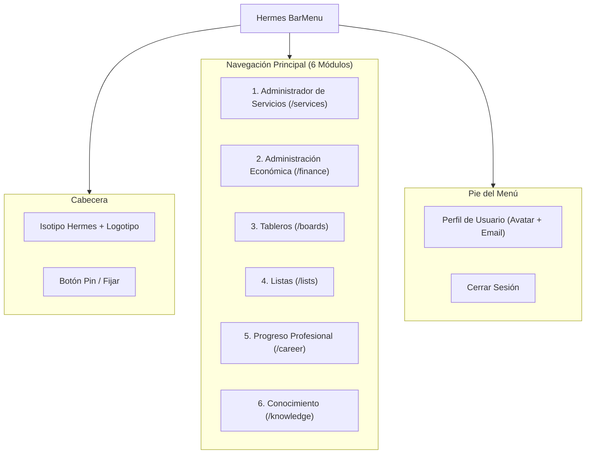
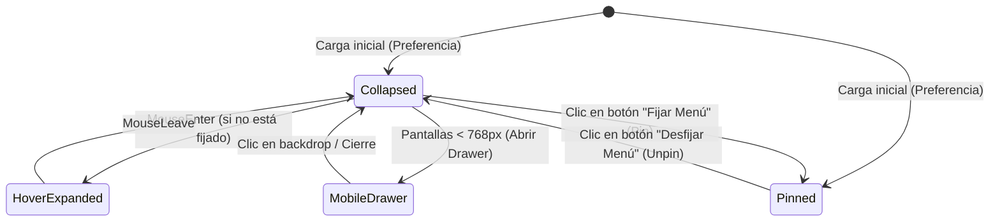

# Especificación de Requerimientos: Menú Lateral Retráctil y Fijo (BarMenu)

Este documento detalla los requerimientos de diseño, comportamiento interactivo, animaciones y arquitectura de software para el menú lateral de navegación de la plataforma **Hermes**.

---

## 1. Objetivos del Componente

* Proveer un sistema de navegación centralizado, accesible y altamente responsivo para todas las áreas funcionales de Hermes.
* Ofrecer un **comportamiento dual fluido**:
  1. **Modo Retráctil / Compacto (Collapsed)**: Minimiza la interferencia visual maximizando el área de trabajo del usuario.
  2. **Modo Fijo (Pinned)**: Fija la barra lateral expandida con etiquetas y detalles visuales completos.
* Proporcionar una experiencia visual premium con modo oscuro profundo, acentos neón en **Azul (`#00E5FF`)** y **Rosa (`#FF007F`)**, efectos glassmorphism (`backdrop-filter: blur(18px)`) y micro-animaciones en cada interacción.
* Persistir la preferencia de visualización del usuario (Fijo vs. Retráctil) mediante almacenamiento local.

---

## 2. Módulos y Opciones del Menú

El menú lateral debe incluir obligatoriamente las siguientes **6 secciones principales**, acompañadas de una cabecera de marca y un pie de control de usuario:



### 2.1. Detalle Funcional de los 6 Módulos

| # | Módulo | Ruta Base | Icono / Identidad Visual | Descripción y Alcance Funcional |
|---|---|---|---|---|
| **1** | **Administrador de servicios** | `/services` | Red / Nube de Conexiones (*Accent Teal/Blue*) | Gestión de integraciones externas (Google Drive, Google Calendar, Gmail, APIs externas, webhooks y estado de sincronización). |
| **2** | **Administración económica** | `/finance` | Gráfica financiera / Billetera (*Accent Teal/Emerald*) | Control financiero y presupuestario: registro de ingresos/egresos, métricas de ahorro, gráficos interactivos y balances. |
| **3** | **Tableros** | `/boards` | Columnas Kanban / Cards (*Accent Blue*) | Gestión visual de flujos de trabajo mediante tableros dinámicos tipo Kanban, estados de proyectos y seguimiento ágil. |
| **4** | **Listas** | `/lists` | Checklist / Tareas (*Accent Pink*) | Listas de verificación, tareas pendientes (To-Do), notas rápidas y categorización por prioridades. |
| **5** | **Progreso profesional** | `/career` | Cohete / Diana de Objetivos (*Accent Pink/Blue*) | Tracker de desarrollo profesional: metas trimestrales, árbol de habilidades (skills tracker), cursos y certificaciones. |
| **6** | **Conocimiento** | `/knowledge` | Cerebro / Wiki / Nodos (*Accent Teal/Blue*) | Segundo cerebro ("Second Brain") y base de conocimiento: notas interconectadas en Markdown, snippets de código y documentación. |

---

## 3. Estados y Comportamientos Interactivos del Menú

El menú lateral implementa una máquina de estados con 4 modos operativos:



### 3.1. Modo Fijo / Expandido (`isPinned = true`)
* **Ancho**: `260px` fijo.
* **Layout**: Empuja el contenedor principal de la aplicación (`margin-left: 260px` con transición fluida).
* **Contenido Visible**:
  - Logotipo completo "Hermes Platform" con degradado azul-rosa.
  - Nombres completos de las 6 secciones.
  - Insignias de conteo (e.g. número de tareas pendientes o servicios activos).
  - Botón de Pin en estado activo (rotado con iluminación neón azul/rosa).
  - Tarjeta de usuario con avatar, nombre, correo y botón de cerrar sesión.

### 3.2. Modo Retráctil / Compacto (`isPinned = false`, no hover)
* **Ancho**: `72px` compacto.
* **Layout**: El contenedor principal se expande para aprovechar todo el espacio (`margin-left: 72px`).
* **Contenido Visible**:
  - Isotipo condensado de Hermes (glifo minimalista con pulso neón).
  - Únicamente los iconos de los 6 módulos centrados.
  - Avatar de usuario condensado en un círculo con anillo de estado.
* **Tooltips Flotantes (Flyout Badges)**:
  - Al pasar el cursor sobre un icono, se despliega a la derecha un tooltip flotante con efecto glassmorphism (`backdrop-filter: blur(12px)`), borde brillante y título del módulo.

### 3.3. Modo Hover Dinámico (Auto-expand on hover)
* Cuando el usuario tiene el menú desfijado (`isPinned = false`) y pasa el cursor sobre la barra de `72px`:
  - La barra se expande temporalmente a `260px`.
  - **Comportamiento Flotante**: No empuja el contenido de la página, sino que flota por encima con `z-index: 100` y una sombra difusa profunda (`box-shadow: 0 10px 40px rgba(0, 0, 0, 0.8)`).
  - Al salir el puntero (`mouseleave`), se contrae suavemente a `72px`.

### 3.4. Modo Móvil / Drawer Offcanvas (`< 768px`)
* En dispositivos móviles, la barra lateral se posiciona fuera de la pantalla (`transform: translateX(-100%)`).
* Se abre al presionar un botón de menú hamburguesa en la barra superior.
* Se superpone con un fondo oscuro translúcido (`backdrop-filter: blur(8px)`).

---

## 4. Sistema de Diseño y Micro-Animaciones

El menú lateral debe cumplir con los más altos estándares visuales del proyecto Hermes:

### 4.1. Variables de Color
```css
:root {
  --hermes-bg-base: #0c0c0e;
  --hermes-bg-surface: #17171c;
  --hermes-bg-surface-hover: #22222a;
  
  --hermes-accent-blue: #00E5FF;
  --hermes-accent-pink: #FF007F;
  --hermes-accent-teal: #00FFC6;
  
  --hermes-text-primary: #F4F4F5;
  --hermes-text-muted: #94949E;
  
  --sidebar-width-expanded: 260px;
  --sidebar-width-collapsed: 72px;
  --sidebar-transition: width 0.35s cubic-bezier(0.16, 1, 0.3, 1), transform 0.35s cubic-bezier(0.16, 1, 0.3, 1);
}
```

### 4.2. Especificaciones de Micro-Animaciones
1. **Píldora Indicadora de Ruta Activa (Active Route Indicator)**:
   - Una barra vertical neón de `3px` de grosor en el borde izquierdo del elemento activo.
   - Posee un gradiente entre `--hermes-accent-blue` y `--hermes-accent-pink` con `box-shadow: 0 0 12px var(--hermes-accent-blue)`.
   - Se desliza suavemente (`transition: transform 0.3s cubic-bezier(0.16, 1, 0.3, 1)`) al cambiar de ruta.
2. **Efecto Hover de Íconos**:
   - Los íconos no activos tienen opacidad al 70% (`color: var(--hermes-text-muted)`).
   - Al pasar el cursor, el ícono escala ligeramente (`transform: scale(1.1)`), adquiere color primario y emite un sutil resplandor neón correspondiente a su módulo.
3. **Animación del Botón Pin (Pin Toggle)**:
   - El icono del pin rota 45° al fijarse y se ilumina con una sombra neón azul/rosa.
   - En estado desfijado, se muestra con opacidad reducida y rota a 0°.
4. **Desvanecimiento de Textos (Text Fade & Clip)**:
   - Al contraer la barra, los textos realizan una transición de `opacity: 0` y `transform: translateX(-10px)` antes de que el ancho termine de reducirse, evitando cortes bruscos o saltos de línea indeseados.

---

## 5. Arquitectura de Componentes Frontend (Nuxt 4)

El menú lateral se estructurará de forma modular dentro de `app/` respetando Atomic Design:

```
hermes-platform/app/
├── components/
│   ├── atoms/
│   │   ├── SidebarPinToggle.vue   # Botón interactivo para alternar estado Pinned
│   │   └── SidebarTooltip.vue     # Tooltip flotante para el modo colapsado
│   ├── molecules/
│   │   ├── SidebarItem.vue        # Elemento individual de navegación con icono y badge
│   │   └── SidebarUserCard.vue    # Mini tarjeta de perfil en el pie del menú
│   └── organisms/
│       └── HermesSidebar.vue      # Contenedor principal de la barra lateral
├── composables/
│   └── useSidebarState.ts         # Estado reactivo global del menú y persistencia
├── layouts/
│   └── default.vue                # Layout global que orquesta Sidebar + Viewport principal
└── pages/
    ├── services.vue               # Vista Administrador de Servicios
    ├── finance.vue                # Vista Administración Económica
    ├── boards.vue                 # Vista Tableros
    ├── lists.vue                  # Vista Listas
    ├── career.vue                 # Vista Progreso Profesional
    └── knowledge.vue              # Vista Conocimiento
```

### 5.1. Composable de Estado: `useSidebarState.ts`
Gestionará la persistencia y la sincronización entre componentes:

```typescript
export interface SidebarState {
  isPinned: boolean
  isHovered: boolean
  isMobileOpen: boolean
}

// Métodos expuestos:
// - togglePin(): Alterna y guarda en localStorage ('hermes_sidebar_pinned')
// - setHovered(val: boolean): Controla el auto-expand temporal
// - toggleMobile(): Alterna el drawer en pantallas pequeñas
// - isExpanded: Computed que evalúa (isPinned || isHovered)
```

---

## 6. Criterios de Aceptación y Validación

1. **Persistencia**: Si el usuario fija la barra lateral y recarga la página, la barra debe permanecer fija en `260px` sin parpadeos.
2. **Fluidez Visual**: La transición entre los `72px` y los `260px` no debe generar saltos de layout en el contenido principal (`transition: margin-left 0.35s`).
3. **Navegación**: Cada uno de los 6 módulos debe enlazar correctamente a su ruta correspondiente marcando visualmente el estado activo.
4. **Compatibilidad Móvil**: En pantallas menores a `768px`, el menú se oculta y responde al toggle móvil sin romper la vista del dashboard.
