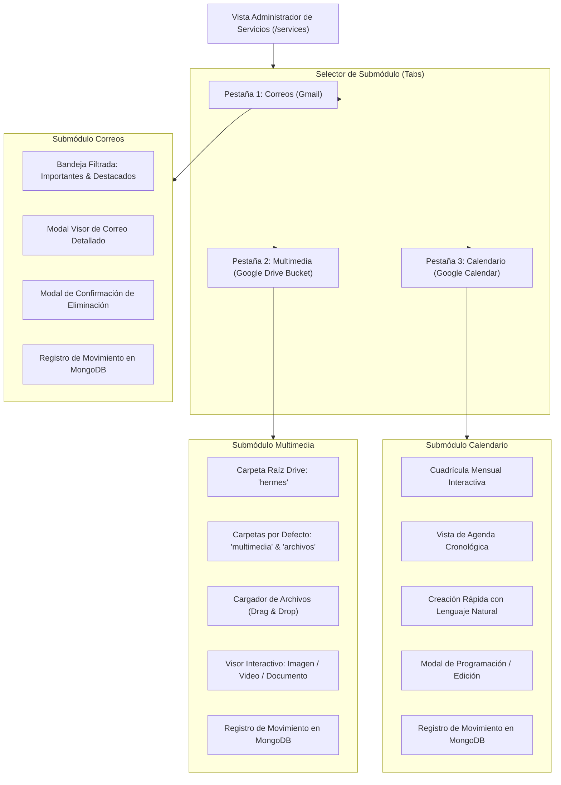

# Especificación de Requerimientos: Administrador de Servicios (Services)

Este documento detalla los requerimientos funcionales, técnicos, arquitectónicos y de interfaz de usuario para el módulo **Administrador de Servicios (`/services`)** de la plataforma **Hermes**.

---

## 1. Objetivos del Módulo

* Proveer un centro de comando unificado para interactuar directamente con los servicios en la nube de Google vinculados a la cuenta del usuario (**Gmail**, **Google Drive** y **Google Calendar**).
* Implementar un selector conmutable de alto impacto visual entre tres submódulos principales:
  1. **"Correos"**: Visualización exclusiva de correos electrónicos **importantes** y **destacados**, lectura en modal detallado, eliminación con diálogo de confirmación y registro obligatorio de movimientos en bitácora de auditoría.
  2. **"Multimedia"**: Almacenamiento tipo *Bucket Cloud* en el Google Drive del usuario bajo una carpeta raíz `"hermes"`, con estructura automática de subcarpetas (`"multimedia"` y `"archivos"`), carga de cualquier tipo de archivo y visualizadores interactivos con vista previa para imágenes, videos y documentos.
  3. **"Calendario"**: Administración en tiempo real de eventos de **Google Calendar** con vista mensual interactiva, vista de agenda cronológica, creación rápida con lenguaje natural (`quickAdd`), programación completa con categorías de colores neón y sincronización inmediata con la cuenta de Google.
* Cumplir con los estándares de diseño de Hermes: fondo dark mode profundo (`#0c0c0e`), acentos neón en **Azul (`#00E5FF`)** y **Rosa (`#FF007F`)**, efectos glassmorphism (`backdrop-filter: blur(18px)`) y micro-animaciones fluidas.

---

## 2. Arquitectura de Navegación y Selector de Submódulos

La vista principal de `/services` presentará un selector de pestañas (Tabs) estilizado con una píldora deslizante con gradiente neón:



---

## 3. Especificación Funcional: Submódulo "Correos" (Gmail)

### 3.1. Filtrado y Listado de Correos
* **Criterio de Consulta**: La plataforma consultará la API de Gmail utilizando los tokens OAuth del usuario, filtrando estrictamente los correos que cumplan con al menos una de estas condiciones:
  - Marcados como **Destacados** (`is:starred` / `label:STARRED`).
  - Marcados como **Importantes** (`is:important` / `label:IMPORTANT`).
* **Barra de Herramientas y Subfiltros**:
  - Filtro rápido: `Todos los Prioritarios` | `Solo Destacados ⭐` | `Solo Importantes 🏷️`.
  - Buscador en tiempo real por remitente, asunto o contenido.
  - Botón de refresco manual con micro-animación de rotación.
* **Componente de Tarjeta de Correo (`EmailCard`)**:
  - **Remitente**: Nombre y avatar/inicial con anillo de color.
  - **Asunto**: Texto resaltado en blanco/primario.
  - **Snippet**: Resumen de 1-2 líneas del cuerpo del mensaje.
  - **Insignias**: Badge dorado/amarillo para ⭐ Destacados, badge azul neón para 🏷️ Importantes.
  - **Fecha/Hora**: Formato relativo legible (ej. "Hace 15 min", "Ayer, 18:30").
  - **Acciones Rápidas**: Botón de previsualización y botón de eliminar (ícono de papelera).

### 3.2. Ventana de Lectura Detallada (`EmailDetailModal`)
Al hacer clic sobre cualquier correo de la lista, se abrirá un modal de lectura con:
* **Cabecera**: Remitente completo con correo electrónico, destinatarios, fecha/hora exacta y etiquetas asignadas.
* **Cuerpo del Mensaje**:
  - Soporte dual para contenido **HTML sanitizado** (renderizado seguro libre de scripts maliciosos) y texto plano.
  - Scrollbar personalizado y tipografía adaptada al tema oscuro de Hermes.
* **Adjuntos**:
  - Si el correo incluye archivos adjuntos, se listarán con su nombre, tamaño y tipo de archivo, permitiendo su descarga directa.
* **Botones de Acción**:
  - "Cerrar".
  - "Eliminar Correo" (dispara el flujo de confirmación).

### 3.3. Eliminación con Modal de Confirmación (`DeleteEmailModal`)
Para evitar eliminaciones accidentales:
1. El usuario presiona "Eliminar Correo".
2. Se despliega una ventana modal con advertencia crítica en color rosa neón (`--hermes-accent-pink`):
   - Mensaje: *¿Estás seguro de que deseas enviar este correo a la papelera de Gmail?*
   - Detalles: Muestra el asunto y remitente del correo a eliminar.
3. Botones:
   - `Cancelar`: Cierra el modal sin realizar ninguna acción.
   - `Confirmar Eliminación`: Llama al endpoint de backend para mover el correo a la papelera (`messages.trash` de Gmail API).

### 3.4. Registro de Auditoría de Movimientos (Audit Trail)
Cualquier acción de eliminación o modificación sobre correos electrónicos debe guardarse de forma inmutable en MongoDB:

```json
{
  "_id": "ObjectId(...)",
  "user_id": "firebase_uid_12345",
  "user_email": "usuario@gmail.com",
  "service": "GMAIL",
  "action": "DELETE_EMAIL",
  "resource_id": "18f92a10b45c89e2",
  "resource_title": "Factura de Servicio Cloud #9843",
  "details": {
    "sender": "billing@google.com",
    "snippet": "Estimado cliente, adjuntamos su factura correspondiente a...",
    "labels_before_delete": ["IMPORTANT", "INBOX"]
  },
  "timestamp": "2026-08-14T23:30:00Z",
  "status": "SUCCESS",
  "ip_address": "192.168.1.50"
}
```

---

## 4. Especificación Funcional: Submódulo "Multimedia" (Google Drive Bucket)

### 4.1. Estructura de Carpetas Automática en Google Drive
Al acceder al submódulo Multimedia, el backend ejecuta una rutina de aprovisionamiento:
1. **Verificación de Carpeta Raíz**:
   - Busca en el Google Drive del usuario una carpeta con nombre exacto `"hermes"` en el directorio raíz.
   - Si no existe, la crea automáticamente mediante la API de Google Drive (`application/vnd.google-apps.folder`).
2. **Subcarpetas Obligatorias por Defecto**:
   - Verifica y crea dentro de `"hermes"` dos subcarpetas esenciales:
     - `hermes/multimedia`: Destinada a almacenar fotos, gráficos, videos y audios.
     - `hermes/archivos`: Destinada a almacenar documentos (PDFs, hojas de cálculo, presentaciones, ZIPs, TXT).
3. **Nuevas Carpetas Personalizadas**:
   - El usuario podrá crear nuevas subcarpetas dentro de `"hermes"` o dentro de las subcarpetas existentes.

```
Google Drive del Usuario /
└── 📁 hermes/                   <-- Carpeta Raíz de la Plataforma
    ├── 📁 multimedia/           <-- Creada por defecto
    │   ├── 📷 banner-hermes.png
    │   └── 🎥 demo-video.mp4
    ├── 📁 archivos/             <-- Creada por defecto
    │   ├── 📄 reporte-q3.pdf
    │   └── 📊 finanzas-2026.xlsx
    └── 📁 [carpetas_usuario]/   <-- Carpetas adicionales creadas por el usuario
```

### 4.2. Explorador de Archivos y Carpetas (Drive Explorer)
* **Barra de Navegación / Breadcrumbs**: Permite navegar entre la raíz `hermes`, `multimedia`, `archivos` y carpetas anidadas (ej. `hermes > multimedia > proyectos`).
* **Vistas Disponibles**:
  - **Vista Cuadrícula (Grid)**: Tarjetas visuales con miniaturas de imágenes y videos, o íconos representativos por tipo de documento.
  - **Vista Lista (Table)**: Filas con nombre, tipo de archivo, tamaño, fecha de modificación y menú de acciones.
* **Barra de Herramientas**:
  - Botón `Nueva Carpeta`.
  - Botón `Subir Archivo(s)` / Zona de arrastre (**Drag & Drop**).
  - Buscador y filtro por tipo (`Todos`, `Imágenes`, `Videos`, `Documentos`).

### 4.3. Carga de Archivos (Upload Center)
* Se permite la subida de cualquier extensión de archivo.
* **Mecanismo de Subida**:
  - Drag & Drop directo sobre la carpeta activa.
  - Indicador de progreso de subida en tiempo real con porcentaje y animación neón.
  - Sincronización inmediata con el listado tras completar la subida.
* **Registro de Auditoría**: Cada subida de archivo genera un registro en MongoDB con la acción `UPLOAD_FILE`.

### 4.4. Visor y Previsualización Interactiva (`FilePreviewModal`)
Al hacer clic en un archivo, se abre el visor multimedia de acuerdo a su tipo MIME:

| Tipo de Archivo | Extensiones Comunes | Comportamiento del Visor |
|---|---|---|
| **Imágenes** | `.png`, `.jpg`, `.jpeg`, `.webp`, `.gif`, `.svg` | Visualizador de alta definición en modal oscuro, con zoom interactivo, ajuste de pantalla y descarga. |
| **Videos** | `.mp4`, `.webm`, `.mov`, `.mkv` | Reproductor de video HTML5 integrado con barra de controles personalizada, reproducción continua y modo pantalla completa. |
| **Audios** | `.mp3`, `.wav`, `.ogg`, `.m4a` | Reproductor de audio con onda de sonido visual y controles de reproducción. |
| **Documentos** | `.pdf` | Visor de PDF integrado con scroll vertical y paginación. |
| **Ofimática / Otros** | `.docx`, `.xlsx`, `.pptx`, `.txt`, `.zip` | Iframe de vista previa de Google Drive (`preview link`) o visor de texto plano con botón de descarga directa. |

---

## 5. Diseño Visual y Micro-Animaciones (UI/UX)

### 5.1. Variables y Estética
* **Paleta**:
  - Fondo Base: `--hermes-bg-base: #0c0c0e`
  - Superficie de Tarjetas: `--hermes-bg-surface: #17171c`
  - Pestaña Activa: Gradiente lineal `135deg, var(--hermes-accent-blue), var(--hermes-accent-pink)`
  - Glows y Bordes: `rgba(0, 229, 255, 0.2)` y `rgba(255, 0, 127, 0.2)`
* **Micro-Animaciones**:
  - Transición suave al alternar entre pestañas con efecto slide/fade (`opacity + transform`).
  - Hover sobre tarjetas de correos y archivos con elevación (`translateY(-3px)`) y borde iluminado.
  - Modales con entrada elástica (`cubic-bezier(0.16, 1, 0.3, 1)`) y desenfoque de fondo (`backdrop-filter: blur(16px)`).

---

## 6. Arquitectura del Backend (`hermes-api`)

### 6.1. Endpoints RESTful (`src/app/endpoints/services.py`)

#### Módulo Correos (Gmail)
* `GET /api/v1/services/emails`: Obtiene la lista de correos importantes y destacados con soporte de paginación (`page_token`) y búsqueda.
* `GET /api/v1/services/emails/{message_id}`: Obtiene el cuerpo completo formateado, cabeceras y lista de adjuntos de un correo.
* `DELETE /api/v1/services/emails/{message_id}`: Mueve el correo a la papelera en Gmail y registra el movimiento en `service_audit_logs`.

#### Módulo Multimedia (Google Drive)
* `GET /api/v1/services/drive/bucket`: Verifica y aprovisiona la carpeta `hermes` y sus subcarpetas (`multimedia`, `archivos`). Retorna la estructura de carpetas.
* `GET /api/v1/services/drive/files`: Lista archivos y subcarpetas dentro de un `folder_id` específico.
* `POST /api/v1/services/drive/folders`: Crea una nueva subcarpeta dentro de una carpeta existente.
* `POST /api/v1/services/drive/upload`: Sube uno o varios archivos mediante `multipart/form-data` a una carpeta determinada.
* `DELETE /api/v1/services/drive/files/{file_id}`: Elimina o envía a la papelera un archivo de Drive y registra el movimiento en auditoría.
* `GET /api/v1/services/drive/files/{file_id}/preview`: Genera URL segura de previsualización o stream del archivo.

#### Auditoría
* `GET /api/v1/services/audit-logs`: Consulta el historial de movimientos de servicios del usuario autenticado con filtros por fecha y servicio.

### 6.2. Capa de Servicios Backend
* **`src/services/gmail_service.py`**:
  - Descifra el `google_access_token` del usuario desde MongoDB.
  - Instancia el cliente de Google Gmail API v1.
  - Métodos: `list_priority_emails()`, `get_email_details()`, `trash_email()`.
* **`src/services/drive_service.py`**:
  - Descifra el `google_access_token` del usuario.
  - Instancia el cliente de Google Drive API v3.
  - Métodos: `ensure_hermes_bucket()`, `list_folder_contents()`, `create_folder()`, `upload_file()`, `trash_file()`.
* **`src/services/audit_service.py`**:
  - Persiste asíncronamente los logs en la colección `service_audit_logs` de MongoDB.

### 6.3. Modelos Pydantic (`src/models/`)
* **Request (`src/models/request/services.py`)**:
  - `DeleteEmailRequest`: confirmación opcional de motivo.
  - `CreateFolderRequest`: `name`, `parent_folder_id`.
* **Response (`src/models/response/services.py`)**:
  - `EmailSummaryResponse`: `id`, `thread_id`, `sender`, `subject`, `snippet`, `is_starred`, `is_important`, `date`.
  - `EmailDetailResponse`: `id`, `sender`, `recipient`, `subject`, `date`, `body_html`, `body_text`, `attachments`.
  - `DriveBucketResponse`: `root_id`, `multimedia_id`, `archivos_id`, `folders`.
  - `DriveFileResponse`: `id`, `name`, `mime_type`, `size`, `thumbnail_url`, `web_view_link`, `created_time`, `icon_type`.
  - `AuditLogResponse`: `id`, `service`, `action`, `resource_title`, `timestamp`, `status`.

---

## 7. Arquitectura del Frontend (`hermes-platform`)

Estructura modular de componentes dentro de `app/`:

```
hermes-platform/app/
├── components/
│   ├── atoms/
│   │   ├── ServiceTabButton.vue       # Botón de pestaña con indicador activo neón
│   │   ├── FileTypeIcon.vue           # Ícono dinámico según extensión (video, imagen, doc)
│   │   └── AuditBadge.vue             # Insignia de estado de auditoría
│   ├── molecules/
│   │   ├── EmailCard.vue              # Tarjeta de correo en lista
│   │   ├── DriveBreadcrumb.vue        # Barra de ruta de carpetas
│   │   ├── DriveFileCard.vue          # Tarjeta de archivo con thumbnail y menú
│   │   └── FileUploadZone.vue         # Zona de Drag & Drop para subida de archivos
│   ├── organisms/
│   │   ├── EmailListSection.vue       # Vista completa de gestión de correos
│   │   ├── DriveBucketSection.vue     # Vista completa de gestión de archivos Drive
│   │   ├── EmailDetailModal.vue       # Modal de visualización de correo
│   │   ├── DeleteConfirmModal.vue     # Modal de confirmación para eliminación
│   │   └── FilePreviewModal.vue       # Visor universal de imágenes, videos y docs
│   └── templates/
│       └── ServicesTemplate.vue       # Orquestador del layout de Servicios
├── composables/
│   ├── useGmailService.ts             # Lógica reactiva de obtención, lectura y borrado de correos
│   └── useDriveBucket.ts              # Lógica reactiva de carpetas, uploads y preview
└── pages/
    └── services.vue                   # Página principal que consume ServicesTemplate
```

---

## 8. Criterios de Aceptación y Validación

1. **Selector de Submódulos**: La transición entre "Correos" y "Multimedia" debe ser instantánea y recordar la pestaña activa.
2. **Correos Prioritarios**: Solo deben listarse correos marcados como importantes o destacados en la cuenta del usuario.
3. **Modal de Lectura**: El contenido del correo debe renderizarse adecuadamente sin romper la vista del dashboard.
4. **Confirmación y Borrado**: No debe ser posible eliminar un correo sin pasar por el modal de confirmación, y la acción debe quedar registrada en MongoDB con timestamp y datos del correo.
5. **Aprovisionamiento Automático en Drive**: Al ingresar al módulo multimedia, deben existir y ser accesibles la carpeta `"hermes"` y las subcarpetas `"multimedia"` y `"archivos"`.
6. **Previsualización Multimedia**: Las imágenes deben abrirse en visor con zoom, los videos deben reproducirse directamente con HTML5, y los PDFs/documentos deben poder previsualizarse fluidamente.
