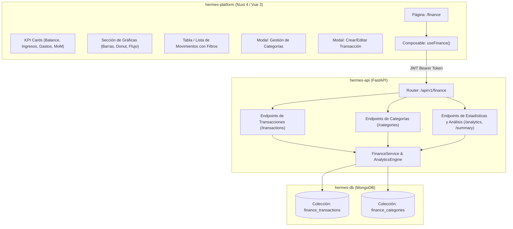

# Especificación Funcional y Técnica: Módulo de Administración Económica (Economy & Finance)

Este documento detalla la arquitectura, modelo de datos, endpoints de API y componentes de interfaz de usuario para el módulo **Administración Económica** (`/finance`) de la plataforma **Hermes**.

---

## 1. Visión General y Objetivos del Módulo

El módulo de Administración Económica permite a los usuarios gestionar de forma centralizada sus ingresos y egresos, clasificar sus movimientos en categorías personalizables, analizar su salud financiera mediante métricas comparativas mes a mes (*Month-over-Month*) y visualizar tendencias a través de gráficas interactivas y animadas bajo el sistema de diseño Dark & Neon de Hermes.

### Objetivos Clave:
1. **CRUD Integral de Transacciones**: Registro, edición, consulta filtrada y eliminación de ingresos (*income*) y gastos (*expense*).
2. **Gestión Flexible de Categorías**: Creación, personalización (nombre, color neón, icono/emoji) y eliminación de categorías de usuario, con un catálogo base predeterminado.
3. **Análisis e Inteligencia Financiera Mensual**:
   - Selector de periodo (Mes/Año).
   - KPIs de Balance Neto, Tasa de Ahorro y variación porcentual con respecto al mes anterior.
   - Detección automática del mayor gasto del mes y la categoría con mayor impacto financiero.
4. **Visualización Gráfica Interactiva**:
   - Gráfica de barras comparativa: Relación Ingresos vs. Gastos (histórico semestral o anual).
   - Gráfica de distribución por categoría (Donut/Pie Chart) con porcentajes y montos.
   - Gráfica de evolución y flujo acumulado en el tiempo.

---

## 2. Arquitectura del Módulo y Flujo de Datos



---

## 3. Modelo de Datos (MongoDB)

### 3.1. Colección `finance_categories`
Define las categorías disponibles para ingresos y gastos.

```json
{
  "_id": "ObjectId(...)",
  "user_id": "google_oauth2|123456789", // null si es categoría predeterminada del sistema
  "name": "Alimentación & Supermercado",
  "type": "EXPENSE", // "INCOME" o "EXPENSE"
  "icon": "🛒", // Emoji o identificador de icono
  "color": "#00FFC6", // Hexadecimal para acentos y gráficas
  "is_default": false, // true para categorías globales del sistema
  "created_at": "2026-08-15T00:00:00.000Z",
  "updated_at": "2026-08-15T00:00:00.000Z"
}
```

#### Categorías Predeterminadas del Sistema (Seed):
* **Gastos (`EXPENSE`)**:
  - 🏠 Vivienda & Servicios (`#00E5FF`, `🏠`)
  - 🛒 Supermercado & Alimentación (`#00FFC6`, `🛒`)
  - 🚗 Transporte & Combustible (`#FFD166`, `🚗`)
  - 🍿 Entretenimiento & Ocio (`#FF007F`, `🍿`)
  - 💊 Salud & Bienestar (`#06D6A0`, `💊`)
  - 📚 Educación & Cursos (`#118AB2`, `📚`)
  - 🛍️ Compras Personales (`#B5179E`, `🛍️`)
  - ⚙️ Otros Gastos (`#94949E`, `⚙️`)
* **Ingresos (`INCOME`)**:
  - 💼 Salario / Sueldo Principal (`#00FFC6`, `💼`)
  - 💻 Freelance & Proyectos (`#00E5FF`, `💻`)
  - 📈 Inversiones & Rendimientos (`#7209B7`, `📈`)
  - 🎁 Regalos & Bonos (`#FF007F`, `🎁`)
  - 💰 Otros Ingresos (`#94949E`, `💰`)

---

### 3.2. Colección `finance_transactions`
Almacena cada movimiento monetario individual del usuario.

```json
{
  "_id": "ObjectId(...)",
  "user_id": "google_oauth2|123456789",
  "title": "Compra mensual de víveres",
  "amount": 2540.50, // Siempre positivo (número decimal / float)
  "type": "EXPENSE", // "INCOME" o "EXPENSE"
  "category_id": "ObjectId(finance_categories._id)",
  "date": "2026-08-14T15:30:00.000Z", // Fecha real del movimiento
  "notes": "Compra realizada en Costco",
  "payment_method": "CREDIT_CARD", // "CASH", "DEBIT_CARD", "CREDIT_CARD", "TRANSFER", "OTHER"
  "tags": ["super", "despensa"],
  "created_at": "2026-08-15T00:00:00.000Z",
  "updated_at": "2026-08-15T00:00:00.000Z"
}
```

#### Índices Recomendados en MongoDB:
```javascript
db.finance_transactions.createIndex({ user_id: 1, date: -1 });
db.finance_transactions.createIndex({ user_id: 1, type: 1, date: -1 });
db.finance_transactions.createIndex({ user_id: 1, category_id: 1 });
db.finance_categories.createIndex({ user_id: 1, type: 1 });
```

---

## 4. Especificación de Endpoints Backend (`hermes-api`)

Todos los endpoints residen bajo el prefijo `/api/v1/finance` y requieren autenticación mediante encabezado `Authorization: Bearer <JWT_TOKEN>`.

### 4.1. Transacciones (`/transactions`)

| Método | Ruta | Descripción | Parámetros / Query |
|---|---|---|---|
| `GET` | `/transactions` | Lista transacciones paginadas con filtros | `year` (int), `month` (int), `type` (INCOME/EXPENSE/all), `category_id` (str), `search` (str), `page` (int, def: 1), `limit` (int, def: 20) |
| `POST` | `/transactions` | Crea una nueva transacción | Payload `TransactionCreateRequest` |
| `GET` | `/transactions/{id}` | Obtiene el detalle de una transacción | `id` (path) |
| `PUT` | `/transactions/{id}` | Actualiza una transacción existente | `id` (path), Payload `TransactionUpdateRequest` |
| `DELETE` | `/transactions/{id}` | Elimina una transacción | `id` (path) |

---

### 4.2. Categorías (`/categories`)

| Método | Ruta | Descripción | Parámetros / Query |
|---|---|---|---|
| `GET` | `/categories` | Lista categorías del usuario + predeterminadas | `type` (INCOME/EXPENSE/all) |
| `POST` | `/categories` | Crea una categoría personalizada | Payload `CategoryCreateRequest` |
| `PUT` | `/categories/{id}` | Edita una categoría de usuario | `id` (path), Payload `CategoryUpdateRequest` |
| `DELETE` | `/categories/{id}` | Elimina una categoría personalizada | `id` (path), reasigna opcional a "Otros" |

---

### 4.3. Resumen y Análisis Financiero (`/analytics`)

#### `GET /api/v1/finance/analytics/summary`
Devuelve el balance y comparativa MoM (*Month-over-Month*) para el mes seleccionado:
```json
{
  "period": { "year": 2026, "month": 8, "month_name": "Agosto" },
  "totals": {
    "total_income": 45000.00,
    "total_expenses": 28350.50,
    "net_savings": 16649.50,
    "savings_rate_percent": 36.99
  },
  "comparison_previous_month": {
    "income_difference": 3000.00,
    "income_percentage_change": 7.14,
    "expense_difference": -1200.50,
    "expense_percentage_change": -4.06,
    "savings_difference": 4200.50,
    "savings_percentage_change": 33.74
  },
  "top_insights": {
    "highest_single_expense": {
      "id": "66bcde...",
      "title": "Pago de Renta Depto",
      "amount": 12000.00,
      "category_name": "Vivienda & Servicios",
      "date": "2026-08-01T10:00:00.000Z"
    },
    "highest_expense_category": {
      "category_id": "66bcde...",
      "category_name": "Vivienda & Servicios",
      "icon": "🏠",
      "color": "#00E5FF",
      "total_amount": 14500.00,
      "percentage_of_total_expenses": 51.14
    }
  }
}
```

#### `GET /api/v1/finance/analytics/category-breakdown`
Desglose agrupado de gastos o ingresos por categoría en el mes solicitado (para gráfica Donut/Pie):
```json
{
  "year": 2026,
  "month": 8,
  "type": "EXPENSE",
  "total": 28350.50,
  "breakdown": [
    {
      "category_id": "cat_1",
      "name": "Vivienda & Servicios",
      "icon": "🏠",
      "color": "#00E5FF",
      "total": 14500.00,
      "percentage": 51.14,
      "transaction_count": 3
    },
    {
      "category_id": "cat_2",
      "name": "Supermercado & Alimentación",
      "icon": "🛒",
      "color": "#00FFC6",
      "total": 6800.50,
      "percentage": 23.98,
      "transaction_count": 8
    },
    {
      "category_id": "cat_3",
      "name": "Entretenimiento & Ocio",
      "icon": "🍿",
      "color": "#FF007F",
      "total": 3500.00,
      "percentage": 12.34,
      "transaction_count": 5
    }
  ]
}
```

#### `GET /api/v1/finance/analytics/monthly-trends`
Histórico de ingresos vs. gastos en los últimos `N` meses (default: 6 meses) para la gráfica de barras:
```json
{
  "months": [
    { "year": 2026, "month": 3, "label": "Mar 26", "income": 40000, "expenses": 27000, "savings": 13000 },
    { "year": 2026, "month": 4, "label": "Abr 26", "income": 41000, "expenses": 29500, "savings": 11500 },
    { "year": 2026, "month": 5, "label": "May 26", "income": 42000, "expenses": 26000, "savings": 16000 },
    { "year": 2026, "month": 6, "label": "Jun 26", "income": 42000, "expenses": 31000, "savings": 11000 },
    { "year": 2026, "month": 7, "label": "Jul 26", "income": 42000, "expenses": 29551, "savings": 12449 },
    { "year": 2026, "month": 8, "label": "Ago 26", "income": 45000, "expenses": 28350, "savings": 16650 }
  ]
}
```

---

## 5. Diseño de Interfaz de Usuario y Componentes (`hermes-platform`)

La vista residirá en `app/pages/finance.vue` respetando la estética Cyberpunk Dark Neon de Hermes.

```
┌──────────────────────────────────────────────────────────────────────────────────────────────────┐
│  💰 ADMINISTRACIÓN ECONÓMICA                                 [ 📅 Agosto 2026 ▼ ] [ + Nuevo Movimiento ] │
├──────────────────────────────────────────────────────────────────────────────────────────────────┤
│                                                                                                  │
│  ┌────────────────────────┐  ┌────────────────────────┐  ┌────────────────────────┐  ┌────────────────────────┐  │
│  │ 💵 TOTAL INGRESOS      │  │ 💸 TOTAL GASTOS        │  │ ⚖️ BALANCE NETO        │  │ 🎯 TASA DE AHORRO      │  │
│  │ $45,000.00             │  │ $28,350.50             │  │ $16,649.50             │  │ 36.99%                 │  │
│  │ ▲ +7.14% vs mes anterior│  │ ▼ -4.06% vs mes anterior│  │ ▲ +33.7% vs mes anterior│  │ Estado: Saludable 🟢   │  │
│  └────────────────────────┘  └────────────────────────┘  └────────────────────────┘  └────────────────────────┘  │
│                                                                                                  │
│  ┌─────────────────────────────────────────────────────────┐  ┌──────────────────────────────────────┐   │
│  │ 📊 Histórico Ingresos vs Gastos (Últimos 6 Meses)       │  │ 🍩 Distribución de Gastos (Ago 2026)  │   │
│  │  [ Gráfica de Barras Neón Azul / Rosa ]                 │  │  [ Donut Chart Interactivo ]          │   │
│  │                                                         │  │  - 🏠 Vivienda (51.1%)               │   │
│  │  Mar    Abr    May    Jun    Jul    Ago                 │  │  - 🛒 Supermercado (24.0%)           │   │
│  │                                                         │  │  - 🍿 Entretenimiento (12.3%)        │   │
│  └─────────────────────────────────────────────────────────┘  └──────────────────────────────────────┘   │
│                                                                                                  │
│  ┌────────────────────────────────────────────────────────────────────────────────────────────┐  │
│  │ 💡 INSIGHT DEL MES:                                                                        │  │
│  │ Mayor gasto: "Pago de Renta Depto" ($12,000.00) • Categoría principal: "Vivienda" (51.1%) │  │
│  └────────────────────────────────────────────────────────────────────────────────────────────┘  │
│                                                                                                  │
│  ┌────────────────────────────────────────────────────────────────────────────────────────────┐  │
│  │ 📋 Historial de Transacciones               [ Todos ▼ ] [ Filtro Categoría ▼ ] [ 🔍 Buscar ]│  │
│  ├────────────────────────────────────────────────────────────────────────────────────────────┤  │
│  │ 14 Ago • 🛒 Compra en Costco (Supermercado)                     -$2,540.50  [ ✏️ ] [ 🗑️ ]    │  │
│  │ 10 Ago • 💻 Pago Freelance Diseño (Freelance)                   +$15,000.00 [ ✏️ ] [ 🗑️ ]    │  │
│  │ 01 Ago • 🏠 Pago de Renta Depto (Vivienda)                      -$12,000.00 [ ✏️ ] [ 🗑️ ]    │  │
│  │ [ ← Anterior ]                                               Página 1 de 3    [ Siguiente → ]│  │
│  └────────────────────────────────────────────────────────────────────────────────────────────┘  │
└──────────────────────────────────────────────────────────────────────────────────────────────────┘
```

### 5.1. Estructura de Componentes Vue

```
app/
├── pages/
│   └── finance.vue                         # Vista principal del módulo financiero
├── components/
│   ├── atoms/
│   │   ├── MoneyBadge.vue                  # Badge con formato monetario, color condicional y glow
│   │   ├── PercentageIndicator.vue         # Indicador con flechas ▲ / ▼ y colores verde/rojo
│   │   └── CategoryTag.vue                 # Píldora de categoría con icono y color personalizado
│   ├── molecules/
│   │   ├── FinanceKpiCard.vue              # Tarjeta KPI con icono, valor, micro-animación y comparativa MoM
│   │   ├── MonthSelector.vue               # Selector con botones mes anterior/siguiente y modal de año
│   │   ├── TransactionRow.vue              # Fila de movimiento con hover glow, acciones rápidas y detalles
│   │   └── InsightBanner.vue               # Banner dinámico destacando el mayor gasto y categoría top
│   └── organisms/
│       ├── FinanceTrendsChart.vue          # Gráfica de barras (Ingresos vs Gastos) en SVG/Canvas dinámico
│       ├── CategoryDonutChart.vue          # Gráfica circular/donut con leyendas animadas
│       ├── TransactionListSection.vue      # Tabla de movimientos con búsqueda, filtros y paginación
│       ├── TransactionModal.vue            # Modal crear/editar movimiento con selector de categorías
│       ├── CategoryManagerModal.vue        # Modal para crear, renombrar y elegir colores de categorías
│       └── DeleteTransactionModal.vue      # Confirmación de borrado con alerta de seguridad
└── composables/
    ├── useFinanceTransactions.ts           # Estado y llamadas a endpoints de transacciones
    ├── useFinanceCategories.ts             # Estado y llamadas a endpoints de categorías
    └── useFinanceAnalytics.ts              # Consultas de métricas, comparativas MoM y gráficas
```

---

## 6. Lógica de Negocio y Reglas de Validación

1. **Montos Siempre Positivos**:
   - El campo `amount` se almacena estrictamente como número positivo (`amount > 0`).
   - El significado contable lo define el campo `type` (`INCOME` suma al balance, `EXPENSE` resta al balance).
2. **Comparativa MoM (Month-over-Month)**:
   - Si el mes anterior no tiene registros, el porcentaje de cambio es `null` y la UI muestra `"Primer mes registrado"`.
   - Fórmula de cambio porcentual:
     $$\Delta\% = \frac{\text{Monto}_{\text{actual}} - \text{Monto}_{\text{anterior}}}{\text{Monto}_{\text{anterior}}} \times 100$$
   - En **Gastos**: Un $\Delta\%$ positivo es de alerta (color rosa/rojo), un $\Delta\%$ negativo es favorable (color teal/verde).
   - En **Ingresos**: Un $\Delta\%$ positivo es favorable (color teal/verde), un $\Delta\%$ negativo es de alerta (color rosa/rojo).
3. **Eliminación Segura de Categorías**:
   - Si una categoría personalizada tiene transacciones asociadas y se desea eliminar, el sistema solicita confirmación y reasigna automáticamente dichas transacciones a la categoría predeterminada correspondiente (*"Otros Gastos"* o *"Otros Ingresos"*).
4. **Persistencia e Indexación**:
   - El usuario solo puede consultar y modificar sus propias transacciones (`user_id = payload.sub`).

---

## 7. Plan de Verificación y Criterios de Aceptación

### Criterios Backend:
* [ ] Modelos Pydantic tipados estrictamente en `src/models/request/finance.py` y `src/models/response/finance.py`.
* [ ] Endpoints de CRUD de transacciones con validación de fechas y montos positivos.
* [ ] Endpoints de CRUD de categorías con inicialización automática de catálogo predeterminado si el usuario no tiene categorías.
* [ ] Endpoint de analíticas `/analytics/summary` calculando correctamente totales, balance neto y comparativa MoM con respecto al mes previo.
* [ ] Endpoint de analíticas `/analytics/category-breakdown` agregando montos y porcentajes por categoría.
* [ ] Endpoint de tendencias `/analytics/monthly-trends` calculando el histórico de los últimos 6 meses.

### Criterios Frontend:
* [ ] Página `/finance` integrada con el menú lateral (*BarMenu*) en la opción "Administración económica".
* [ ] Selector de mes y año reactivo con navegación fluida.
* [ ] Tarjetas KPI animadas mostrando Total Ingresos, Total Gastos, Balance Neto y Tasa de Ahorro con indicadores MoM.
* [ ] Gráfica de barras comparativa Ingresos vs. Gastos y gráfica Donut de categorías con renderizado suave y colores acordes al tema neón.
* [ ] Listado de transacciones con búsqueda en tiempo real, filtro por tipo/categoría y paginación de 10 en 10.
* [ ] Modales de creación/edición de transacciones y gestión de categorías funcionales.
